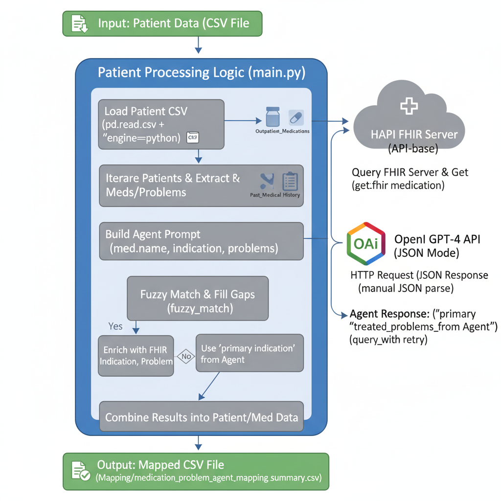

# Clinical RAG Agent: Medication-to-Problem Mapping

# ⚕️ Medical RAG (Retrieval-Augmented Generation) System

This repository implements a **Hybrid Retrieval-Augmented Generation (RAG)** system designed for clinical decision support. It uses a **local, domain-specific vector store (PubMedBERT + Faiss)** for grounded knowledge retrieval and the **Gemini API** for high-performance, structured JSON generation.

The system's goal is to accurately match patient-specific medications to their historical problems using external clinical facts, minimizing hallucinations and grounding results in evidence.

---

## ⚙️ System Architecture Overview

The RAG pipeline operates in two main phases: **Indexing** (one-time setup) and **Querying** (per-medication execution).

---

## 1. Phase I: Knowledge Indexing (The Retriever Setup)

This phase prepares the **`knowledge_base.txt`** for rapid semantic search. This process is handled by **`retriever_setup.py`** and runs upon initial execution.

| Step | Component | Action | Key Technology |
| :--- | :--- | :--- | :--- |
| **1. Load Data** | `knowledge_base.txt` | External medical facts are loaded and split into small text chunks. | N/A |
| **2. Embedding** | **PubMedBERT** | Each text chunk is converted into a high-dimensional numerical vector. | **`sentence-transformers`** |
| **3. Indexing** | **Faiss Index** | The generated vectors are stored in a data structure optimized for quick similarity lookups. | **`faiss-cpu`** |

---

## 2. Phase II: Per-Patient Querying (The RAG Loop)

This phase executes for every medication (`updated_main.py` loop), retrieving context and generating the final structured output.

| Step | Component | Action | Output |
| :--- | :--- | :--- | :--- |
| **4. Query Formulation** | `build_agent_prompt` | A search query is created using the current **Medication Name** and its **Primary Indication**. | A precise search string. |
| **5. Retrieval** | `retrieve_context` | The query is embedded and searched against the **Faiss Index**. The $\text{top k}$ most relevant clinical facts are returned. | **`CRITICAL CONTEXT`** (1-2 text chunks). |
| **6. Prompt Augmentation** | `build_agent_prompt` | The retrieved facts are inserted into the LLM's prompt template alongside the patient's problem list. | A comprehensive prompt ready for generation. |
| **7. Generation** | **Gemini API** (`query_with_retry`) | The augmented prompt is sent to the **`gemini-2.5-flash-lite`** model, which is instructed to base its answer *only* on the provided `CRITICAL CONTEXT`. | A structured **JSON** response (`primary_indication`, `direct_treatment`, `related_conditions`). |
| **8. Validation** | `fuzzy_match_problems` | The lists returned by the LLM are checked against the patient's original problem list to prevent minor spelling errors or non-matching terms. | The final, validated mapping for the patient record. |
